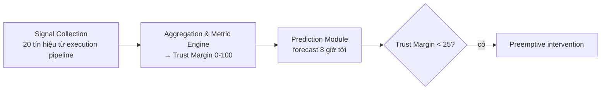

# ADE-PRF: Dự Đoán Reliability Cho Hệ LLM Multi-Agent Chạy Dài

> **Nguồn gốc**: [Agent Delivery Engineering Predictive Reliability Framework — arXiv 2607.07689](https://arxiv.org/abs/2607.07689)
> **Tác giả**: Dexing Liu (Shanghai Qijing Digital Technology) | **Ngày đăng**: 08/07/2026 | **Thời gian đọc**: ~14 phút | ⭐ 4/5

> 📝 Bản tóm tắt ngắn: [[summaries/ade-prf-agent-reliability-prediction]]

Phần lớn tài liệu về observability cho agent (kể cả [[agent-observability|guide của Braintrust]]) tập trung vào việc **nhìn lại** những gì đã xảy ra: trace, span, log để debug sau sự cố. Bài báo này đặt câu hỏi ngược: liệu có thể **dự đoán** một hệ multi-agent sắp suy giảm reliability *trước khi* nó gây lỗi? ADE-PRF là một framework hướng tới điều đó cho các hệ LLM multi-agent chạy dài (long-horizon).

## Vấn đề: "false prosperity"

Các hệ multi-agent thực thi chuỗi task kéo dài tích tụ **compounding failure modes** mà monitoring truyền thống bỏ sót. Tác giả gọi hiện tượng nguy hiểm này là **"false prosperity"**: hệ thống *trông* ổn định (latency, error rate bề mặt bình thường) trong khi các latent reliability issues âm thầm dồn lại — tạo khoảng cách nguy hiểm giữa *performance quan sát được* và *sức khỏe thực sự* của hệ thống.

Đây chính là phiên bản "nâng cấp" của luận điểm trong [[agent-observability]]: HTTP 200 và dashboard xanh không đảm bảo agent đang thực sự khỏe.

## Kiến trúc 3 lớp

1. **Signal Collection Layer** — capture liên tục từ agent execution pipeline.
2. **Aggregation & Metric Engine** — tổng hợp thành health indicator thống nhất (Trust Margin).
3. **Prediction Module** — forecast sức khỏe 8 giờ tới.

## 20 tín hiệu → chỉ số Trust Margin

Framework gom **20 nhóm tín hiệu dị chất (heterogeneous)**, ví dụ tiêu biểu:

- Response latency variance
- Token consumption patterns
- API error rates & types
- Memory utilization trends
- Task completion success/failure sequences
- Agent-to-agent communication delays
- Semantic coherence scores
- Hallucination frequency
- **Context window saturation levels** (giao với [[context-window-management]])
- Chain-of-thought reasoning quality

**Trust Margin** là composite score chuẩn hóa về thang **0–100**, biểu thị "reliability headroom" — dư địa còn lại trước điểm failure được dự đoán. Cách gộp:

1. Mỗi tín hiệu qua **z-score standardization**.
2. Nhân **trọng số theo category**.
3. Merge bằng **harmonic mean** — chọn harmonic mean có chủ đích để **nhấn mạnh điểm yếu nhất** (một signal xấu kéo tụt tổng thể, thay vì bị trung bình cộng làm mờ đi).

## Ba phương pháp dự đoán + horizon 8 giờ

| Method | Vai trò | Cấu hình |
|--------|---------|----------|
| **LSTM** | temporal dependencies trong chuỗi signal | 128-unit hidden, dropout |
| **XGBoost** | non-linear pattern giữa các signal | gradient boosting |
| **Ensemble voting** | kết hợp | weighted avg 0.4 / 0.35 / 0.25 (LSTM / XGBoost / baseline) |

Hệ thống dự đoán **8 giờ tới**, sinh forecast mỗi **10 phút** → **48 forecast tuần tự**. Horizon 8 giờ cân bằng giữa "đủ sớm để can thiệp" và "độ bất định tăng theo thời gian".

## Thực nghiệm & kết quả

**Quy mô** (validate production thật, không phải toy benchmark):
- **380.000+** prediction
- **6 agent profile**: RAG, code generation & execution, multi-turn dialogue, tool-orchestration, long-horizon planning, heterogeneous reasoning
- **15 ngày** chạy liên tục, sampling mỗi 10 phút

**Metric**:

| Metric | Giá trị |
|--------|---------|
| MAE | ±4,2 Trust Margin points |
| RMSE | ±6,8 points |
| Precision (failure prediction) | **89,3%** |
| Recall | **84,7%** |
| False positive rate | 6,2% |
| F1-score | **0,87** |

Ensemble vượt các method đơn lẻ **5–7%** ở recall.

## Ý nghĩa cho production

- **Early warning 8 giờ** → can thiệp phòng ngừa **trước khi** degradation lan thành cascade.
- **Trust Margin threshold** (vd `<25` = critical risk) biến khái niệm reliability trừu tượng thành **alert actionable**.
- **Overhead** ~180ms/prediction cycle (chấp nhận được với sampling 10 phút); cần **3–7 ngày baseline** cho mỗi agent profile mới; export metric **Prometheus-compatible** để cắm vào observability stack sẵn có.
- Chuyển tổ chức từ **reactive incident response** sang **predictive reliability management**, hỗ trợ duy trì SLO cho multi-agent chạy 24h+.

## Góc nhìn cho wiki

ADE-PRF bổ sung một **lớp mới** cho reliability của agent: từ *reactive* (guardrail chặn runaway — [[production-reliability]]; trace debug sau lỗi — [[agent-observability]]) sang *predictive* (leading indicator dự báo sức khỏe). Trust Margin có thể xem như một aggregate của các tín hiệu observability mà [[agent-observability]] đã liệt kê, cộng thêm khả năng dự đoán. Lưu ý phản biện: framework này phức tạp (cần baseline + model training per profile) — phù hợp hệ multi-agent chạy dài, quy mô lớn; với agent đơn giản thì hard-limit + trace vẫn đủ.

## Liên kết wiki
- [[agent-observability]] — observability phản ứng; ADE-PRF thêm chiều predictive
- [[production-reliability]] — guardrail; Trust Margin là lớp dự báo phía trên
- [[context-window-management]] — context saturation là 1 trong 20 signal
- [[silent-tool-call-failures]] — tool error là input signal cho Trust Margin
