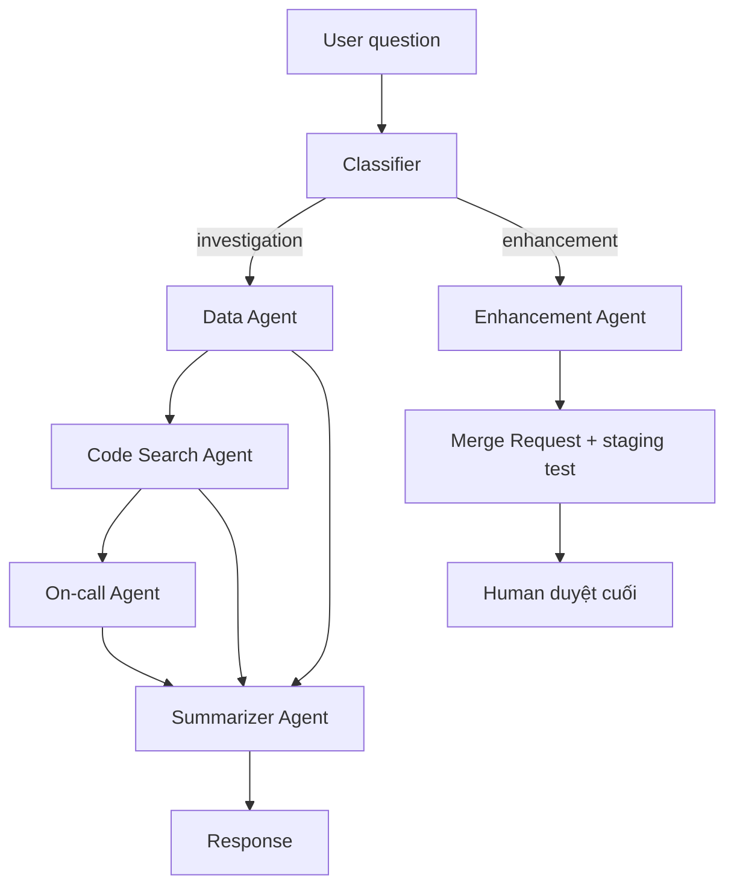

# Từ Chữa Cháy Đến Xây Dựng: Multi-Agent Cho Engineering Support (Grab)

> **Nguồn gốc**: [From firefighting to building: How AI agents restored our team's core productivity — Grab Engineering](https://engineering.grab.com/from-firefighting-to-building)
> **Tác giả**: Sneh Agrawal, Rishi Raj, Ayan Chatterjee, Wen Zhong Tan, Sai Reddy Kakumanu | **Ngày đăng**: 19/03/2026 | **Thời gian đọc**: ~14 phút | ⭐ 5/5

> 📝 Bản tóm tắt ngắn: [[summaries/grab-multi-agent-engineering-support]]

Đây là case study production của Central Data Team tại Grab về việc dùng một hệ **multi-agent** để tự động hóa phần lớn công việc support lặp lại cho nền tảng dữ liệu nội bộ (ADW), giải phóng kỹ sư về lại công việc phát triển giá trị cao. Cùng với [[stripe-financial-compliance-agents|case study Stripe]], đây là ví dụ production thứ hai trong wiki cho thấy một kiến trúc multi-agent thực sự đã chạy ở scale.

## Vấn đề: kỹ sư mất 40% thời gian chữa cháy

ADW (Analytical Data Warehouse) là hạ tầng phân tích lõi của Grab: phục vụ **hơn 1.000 users mỗi tháng**, quản lý **hơn 15.000 tables**, và gánh **~50% mọi query** trong data lake.

Đội vận hành nền tảng tốn **khoảng 40% thời gian — tương đương ~2 ngày mỗi tuần** — cho các việc lặp đi lặp lại: trả lời câu hỏi định nghĩa dữ liệu, trace nguồn dữ liệu và troubleshoot, chạy quality check, và xử lý các enhancement request cơ bản. Đây là công việc "chữa cháy" bào mòn thời gian lẽ ra dành cho xây dựng.

## Kiến trúc multi-agent: 5 chuyên gia hẹp

Thay vì một agent tổng quát, Grab xây **5 agent chuyên biệt**, mỗi agent một nhiệm vụ hẹp:

1. **Data Agent** — query Trino, Hive hoặc Delta Lake; validate schema; **detect PII**; execute có guardrail.
2. **Code Search Agent** — phân tích repo GitLab; trace column transformation và table lineage.
3. **On-call Agent** — search Slack channel + Confluence; check trạng thái pipeline Airflow; monitor data quality metric.
4. **Summarizer Agent** — tổng hợp phản hồi từ nhiều agent thành một narrative mạch lạc.
5. **Enhancement Agent** — sinh code change; tạo merge request; chạy test environment.

Cách tiếp cận "**specialists over generalists**" này trùng khớp bài học từ [[crewai-production-lessons|CrewAI in Production]] (agent hẹp thắng agent 6-tool) và nguyên tắc rail hẹp của [[agent-service-architecture|Stripe]].

## Điều phối "huddle"

Một **Classifier** đứng trước, định tuyến câu hỏi: xác định **agent nào cần và theo thứ tự nào**. Các agent chạy **tuần tự**, và một orchestrator quản lý state, lịch sử hội thoại, và **context handoff** giữa các stage.

Ví dụ với câu hỏi *"Why is the ID unreadable?"*, hệ thống xếp chuỗi: **Data Agent → Code Search Agent → On-call Agent**, rồi Summarizer gộp lại. Đây chính là hiện thân cụ thể của pattern "orchestrator + isolated specialists" mô tả trong [[deployment-topologies|Multi-Agent Distributed]] và [[deployment-topologies|Hierarchical]].

## Tech stack

- **FastAPI + [[langgraph|LangGraph]]** — xử lý request và quản lý state multi-agent.
- **Redis + PostgreSQL** — cache và lưu lịch sử hội thoại bền vững.
- **tiktoken** (đếm token), **RAG** (retrieval-augmented generation).
- Tích hợp nền tảng nội bộ: **Hubble** (metadata), **Genchi** (data quality), **Lighthouse** (pipeline health).

## Hai workflow: Investigation vs Enhancement

- **Investigation** — câu hỏi general kiểu *"Why does this data look wrong?"* đi qua Classifier → các specialist → Summarizer.
- **Enhancement** — request kiểu *"add a new column"* xử lý bán tự động: Enhancement Agent gom context, sinh code, tạo merge request, chạy test ở staging — nhưng **con người duyệt cuối** trước khi lên production. Đây là ví dụ trực tiếp của [[human-in-the-loop|HITL]] ở critical decision point.

## Kết quả

- Tự động resolve **phần lớn** inquiry chuẩn.
- Response time từ *"hours-long manual search"* xuống **"within minutes"**.
- Team **reclaim vài FTE** (full-time equivalent) engineering bandwidth, giải phóng **hàng trăm giờ productivity mỗi tháng**.
- Chuyển từ **reactive support** sang **proactive roadmap delivery** — đúng tinh thần "từ chữa cháy đến xây dựng".

## Nguyên tắc và lớp an toàn

Ba nguyên tắc đúc kết:
1. **Specialists over generalists** — agent hẹp, tập trung thắng hệ monolithic.
2. **Strategic human oversight** — cơ chế review xây niềm tin và cải tiến liên tục.
3. **Automating repetitive tasks** — để con người lo các quyết định giá trị cao.

Các **safety layer**: input classification, SQL validation, timeout protection, **mandatory human review** cho mọi code change, và một hệ **HITL feedback** với annotation dẫn dắt cải tiến lặp.

## Đối chiếu với Stripe

| | [[stripe-financial-compliance-agents]] (Stripe) | Grab |
|---|---|---|
| Domain | Financial compliance review | Internal data-platform support |
| Decomposition | **DAG** sub-task | **Classifier → chuỗi tuần tự** ("huddle") |
| Orchestration | Review Interface + Orchestrator | Classifier + orchestrator state |
| HITL | Reviewer trả lời từng sub-task | Human duyệt code change |
| Thông điệp chung | **Infrastructure-first + specialists + HITL** | (như trái) |

## Liên kết wiki
- [[grab]] — entity; [[grab-palana-secure-agent-platform]] — nền tảng chạy agent an toàn của Grab
- [[agent-service-architecture]] — đối chiếu kiến trúc agent service (Stripe)
- [[deployment-topologies]] — "huddle" ~ multi-agent distributed + hierarchical
- [[human-in-the-loop]] — enhancement cần human duyệt cuối
- [[crewai-production-lessons]] — "specialists over generalists"; [[langgraph]] — stack
