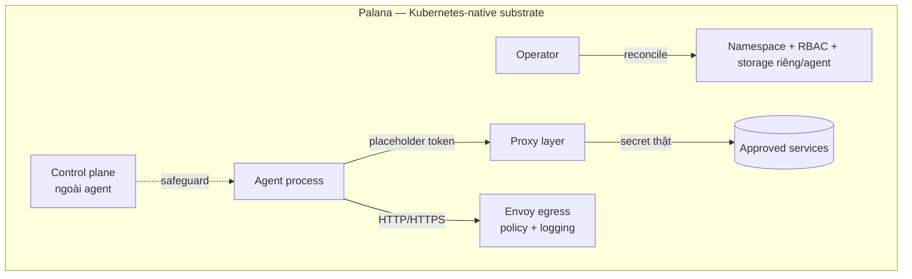

# Palana: Nền Tảng An Toàn Cho AI Agent Tự Chủ (Grab, Part 1)

> **Nguồn gốc**: [Palana (Part 1): Why Grab built a secure platform for autonomous AI Agents — Grab Engineering](https://engineering.grab.com/palana-part-1-secure-platform-for-ai-agents)
> **Tác giả**: Kevin Littlejohn | **Ngày đăng**: 19/06/2026 | **Thời gian đọc**: ~12 phút | ⭐ 4/5

> 📝 Bản tóm tắt ngắn: [[summaries/grab-palana-secure-agent-platform]]

Khi agent bắt đầu **chạy code và gọi tool một cách tự chủ** ở quy mô hàng trăm instance, câu hỏi lớn không còn là "agent thông minh đến đâu" mà là "làm sao **chứa** nó an toàn". Palana là câu trả lời của team CyberSecurity Grab: một **substrate thực thi an toàn** cho agent tự chủ và bán tự chủ. Bài này lấp một mảng còn thiếu của wiki — **agent security ở tầng hạ tầng**, bổ trợ [[agent-infrastructure-stack|Security layer]] và [[production-reliability]].

## Palana là gì

Palana là *"a secure execution substrate for autonomous and semi-autonomous agents"*. Tên bắt nguồn từ tiếng Phạn, mang nghĩa **bảo vệ và chăm sóc** — phản ánh vai trò của nó như một **môi trường chứa (containing)** agent, tách biệt hẳn với phần "trí tuệ" của agent. Nói cách khác, Palana không làm agent thông minh hơn; nó làm agent **an toàn hơn khi chạy**.

## Vì sao Grab xây Palana

- **Catalyst trực tiếp**: đội security research cần một nơi an toàn để test **OpenClaw** và các agent framework khác — **mà không phơi bày internal network** hay phải nhúng raw credential vào agent.
- **Nhu cầu rộng hơn**: các team muốn **long-running agent** có thể giữ context lâu dài, truy cập những service đã được duyệt, và sống sót qua các thay đổi hạ tầng — mà không phải biến mỗi agent thành một dự án hạ tầng bespoke riêng.

## Đang chạy gì

Palana hiện **chạy hàng trăm agent**, gồm: remote development environment, Slack automation, **OpenClaw workers**, **Hermes agents**, và các hệ nội bộ custom. Nó đóng vai trò một **self-service substrate** nội bộ cho agentic workload.

## Kiến trúc & mô hình bảo mật

Palana theo hướng **Kubernetes-native**: mỗi agent được biểu diễn bằng một **custom resource**, và một operator sẽ reconcile namespace, RBAC, storage và policy tương ứng.

Các nguyên tắc bảo mật cốt lõi:

- **Cô lập theo agent**: mỗi agent nhận **namespace, service account và storage riêng biệt**.
- **Proxy-only secrets**: credential **không bao giờ** lộ trực tiếp cho agent — agent chỉ thấy **placeholder token**, và một **proxy layer** thay thế bằng secret thật khi gọi ra ngoài. Đây là điểm thiết kế đắt giá nhất: ngay cả khi agent bị prompt-injection hay compromise, nó không cầm được credential thật.
- **Egress qua Envoy**: mọi luồng HTTP/HTTPS ra ngoài đi qua Envoy với **policy evaluation** và **structured logging** — kiểm soát và audit được agent gọi đi đâu.
- **Control plane tách ngoài**: control plane nằm **ngoài** process của agent, nên một agent bị compromise **không thể tự tắt các safeguard**.

## Ý nghĩa

Palana cho thấy: khi agent thực thi hành động tự chủ ở scale, **guardrail ở tầng prompt là chưa đủ** — cần **containment ở tầng hạ tầng** (isolation, proxy-only secrets, egress policy, control plane bất khả xâm phạm). Đây là góc bổ sung quan trọng cho phần bảo mật của [[production-reliability]] (agent misconfigured hành động sai *một cách chủ động*) và cho [[human-in-the-loop|HITL]] (containment là lớp phòng thủ khi con người không kịp can thiệp).

## Liên kết wiki
- [[grab]] — entity; [[grab-multi-agent-engineering-support]] — case study multi-agent của Grab
- [[agent-infrastructure-stack]] — Palana thuộc **Security layer** của 5-layer stack
- [[production-reliability]] — bảo mật agent; misconfigured agent hành động sai chủ động
- [[human-in-the-loop]] — containment như lớp phòng thủ bổ sung
