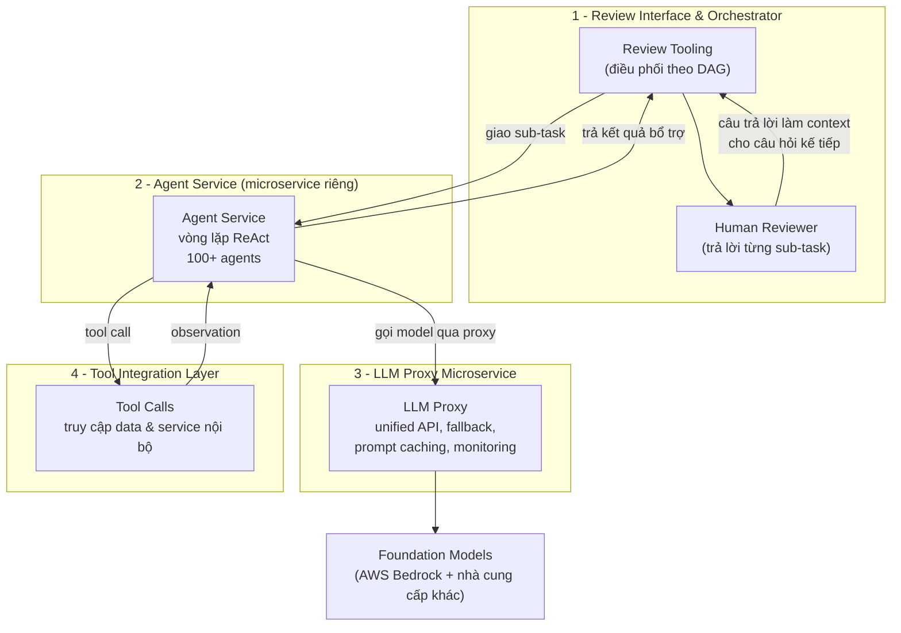

# Production-Grade AI Agents cho Financial Compliance — Case Study Stripe

> **Nguồn gốc**: [AWS Machine Learning Blog](https://aws.amazon.com/blogs/machine-learning/production-grade-ai-agents-for-financial-compliance-lessons-from-stripe/)
> **Tác giả**: Christopher Phillippi, Chrissie Cui, Hasan Tariq, Mohan Musti (AWS + Stripe) | **Ngày đăng**: 26/06/2026 | **Thời gian đọc**: ~12 phút | ⭐ 5/5
> 📝 Bản tóm tắt ngắn: [[summaries/stripe-financial-compliance-agents]]

---

Phần lớn nội dung nói về AI agent trên các hội nghị vẫn dừng ở mức demo. Bài viết này thì khác: nó mô tả một hệ thống agent đã thực sự chạy trên production ở quy mô rất lớn, trong một ngành bị quản lý chặt (regulated) — nơi mà một quyết định sai không chỉ gây khó chịu mà còn kéo theo rủi ro pháp lý. Đây là câu chuyện Stripe đưa AI agent vào quy trình **financial compliance review**, cùng những bài học kiến trúc rút ra được.

## Bài toán kinh doanh: tại sao Stripe cần agent

Stripe xử lý khoảng **1.4 nghìn tỷ USD** (1.4 trillion) khối lượng thanh toán mỗi năm, trải rộng trên **50 quốc gia**. Ở quy mô đó, khối lượng công việc compliance là khổng lồ: đội ngũ phải review hàng nghìn giao dịch mỗi ngày để đáp ứng các chuẩn mực quản lý.

Vấn đề cốt lõi nằm ở chỗ thời gian bị tiêu vào sai việc. Một compliance analyst có kỹ năng cao đáng lẽ nên dành thời gian để **đánh giá rủi ro** (risk assessment) — phần cần chuyên môn con người. Nhưng thực tế, họ tiêu tới **khoảng 80% thời gian** chỉ để đi **gom tài liệu** (gathering documentation): tra cứu, trích xuất, tổng hợp thông tin rải rác trong nhiều hệ thống nội bộ.

Từ đó sinh ra một bài toán scaling kinh điển: làm sao mở rộng năng lực compliance mà **không phải tăng headcount tương ứng**, trong khi vẫn giữ nguyên chất lượng theo chuẩn quản lý? Câu trả lời của Stripe là dùng agent để làm phần gom và tổng hợp thông tin, giải phóng con người cho phần phán đoán.

## Kiến trúc tổng quan: 4 lớp phối hợp

Stripe xây một kiến trúc nhiều lớp gồm bốn thành phần chính, phối hợp với nhau như một dây chuyền.

### Lớp 1 — Review Interface & Orchestrator

Đây là trung tâm điều phối (orchestrator). Công cụ review (review tooling) quản lý toàn bộ workflow điều tra dưới dạng một **DAG (directed acyclic graph)** — đồ thị có hướng, không chu trình. Ý tưởng là một cuộc điều tra compliance được chia thành nhiều câu hỏi/sub-task, và các sub-task có thể **phụ thuộc kết quả của nhau** theo cấu trúc DAG.

Điểm tinh tế: khi reviewer con người trả lời một câu hỏi, hệ thống lấy chính câu trả lời đó làm **context** cho các câu hỏi tiếp theo. Nghĩa là con người và hệ thống cùng "bồi đắp" ngữ cảnh dần dần, thay vì để agent tự chạy một mạch.

### Lớp 2 — Agent Service (một microservice chuyên dụng)

Đây là quyết định kiến trúc quan trọng nhất. Stripe kết luận rằng **hệ thống ML inference truyền thống không phù hợp** cho ứng dụng dạng agentic, nên họ dựng hẳn một **Agent Service** riêng. Lý do:

- **Hồ sơ tính toán khác hẳn (compute profile):** ML truyền thống là **compute-bound** — ngốn GPU đắt tiền hoặc bộ nhớ lớn. Ngược lại, hệ thống agentic là **network-bound**: phần lớn thời gian là *chờ* — chờ foundation model sinh xong, hoặc chờ tool call chạy xong. Hạ tầng tối ưu cho hai bài toán này là khác nhau.
- **Đặc tính latency:** Thời gian chạy của agent là **bất định (indeterminate)**, tùy vào số vòng tool call cần thiết. Vì dùng framework **ReAct**, agent có thể mất bao lâu tùy vào việc nó cần bao nhiêu vòng suy nghĩ - hành động. Hạ tầng phải chịu được sự bất định đó.
- **Yêu cầu API:** Agent cần schema linh hoạt để **annotate kết quả** và duy trì hội thoại **stateful** (nhiều lượt), khác với output đơn giản của ML truyền thống.

Agent Service tiến hóa từ một endpoint **stateless đồng bộ** ban đầu thành một hệ thống hỗ trợ agent hội thoại **multi-turn**. Về quy mô: từ vài agent lúc ra mắt, nó tăng lên **hơn 100 agent trong chưa đầy một năm** — cho thấy khi hạ tầng đúng, việc nhân rộng số lượng agent trở nên khả thi.

> Chi tiết kiến trúc này được phân tích sâu hơn ở [[concepts/agent-service-architecture]].

### Lớp 3 — LLM Proxy Microservice

Thay vì để từng agent gọi trực tiếp API của foundation model, Stripe đặt một **LLM Proxy** làm cổng truy cập chuẩn hóa duy nhất. Proxy này cung cấp:

- **Noisy neighbor protection:** tránh việc nhiều team cùng dùng LLM gây tranh chấp tài nguyên (một team "ồn ào" làm ảnh hưởng team khác).
- **Unified API:** một endpoint duy nhất trừu tượng hóa nhiều foundation model và nhiều capability khác nhau.
- **Model fallbacks:** tự động chuyển sang model mặc định khi bị giới hạn tài nguyên hoặc gặp lỗi.
- **Monitoring & authentication:** theo dõi mức sử dụng để dự báo tài nguyên và chọn model phù hợp.

Proxy hỗ trợ các tính năng như **prompt caching** hay **tool calling** trên nhiều foundation model — từ Amazon lẫn các công ty AI hàng đầu. Lợi ích thực tế rất lớn: **đổi model chỉ cần đổi một argument** (kiểu model), không phải viết lại code tích hợp.

### Lớp 4 — Tool Integration Layer

Agent truy cập dữ liệu và dịch vụ nội bộ một cách **động** thông qua tool call. Lý do phải làm vậy rất thực tế: tập tín hiệu (signals) *có thể* liên quan đến một cuộc điều tra thường **lớn hơn nhiều** so với những gì nhét vừa vào một prompt. Thay vì cố nhồi tất cả vào context, agent gọi tool để lấy đúng thứ nó cần, khi nó cần.

## ReAct: vòng lặp lý luận - hành động

Hệ thống agentic của Stripe vận hành theo các chu kỳ **reasoning và acting** lặp đi lặp lại — đúng tinh thần [[concepts/react-pattern]].

### Vòng lặp ReAct

1. **Thought (suy nghĩ):** agent cân nhắc trạng thái hiện tại và xác định hành động cần làm.
2. **Action (hành động):** agent đề xuất các tool call để thu thập thông tin.
3. **Observation (quan sát):** kết quả tool được đưa ngược trở lại vào context của agent.

Chu kỳ này lặp cho tới khi agent đạt đủ độ tự tin để đưa ra câu trả lời cuối.

### Cơ chế closed-loop control

Điều đáng học nhất ở đây là cách Stripe diễn giải việc "tiêm observation trở lại" như một **hệ điều khiển vòng kín (closed-loop control)** trong kỹ thuật. Nó tạo ra vài lớp bảo vệ quan trọng:

- **Neo lý luận vào dữ liệu thật:** mọi output tool đều *phải* được xử lý, nên agent không thể bịa ra kết quả (chống fabrication).
- **Giữ context mạch lạc:** buộc agent thừa nhận tường minh từng mẩu thông tin trước khi đi tiếp.
- **Chống reasoning drift (trôi dạt lý luận):** mỗi observation đóng vai trò như một checkpoint, kéo lý luận của agent bám vào output thực tế.
- **Hỗ trợ auditability:** tạo ra vết (trace) tường minh theo mạch `tool invocation → observation → reasoning`, có thể log lại để phục vụ compliance review.

Nói cách khác: agent **không được** chuyển sang hành động kế tiếp trước khi đã xử lý feedback (observation) từ hành động trước — giống hệt một hệ phản hồi trong điều khiển học.

## Chia nhỏ nhiệm vụ bằng DAG

Thay vì giao cả một cuộc review phức tạp cho một agent duy nhất, Stripe **phân rã** cuộc điều tra thành các sub-task có thể ghép lại (composable), tổ chức dưới dạng DAG. Mỗi sub-task:

- Có **phạm vi giới hạn (bounded scope)** để agent không bị "trôi" mất tập trung.
- Có thể phụ thuộc kết quả của các sub-task khác.
- Hoạt động như một **"rail" (đường ray)** — nơi chất lượng đã được đo lường qua kiểm thử.
- Đảm bảo cuộc điều tra phủ hết các "bases" (khía cạnh) mà compliance yêu cầu.

Một điểm cực kỳ quan trọng: **dù đã test agent rất kỹ, Stripe vẫn không tin tưởng hoàn toàn (không dựa outright) vào phản hồi của agent.** Thay vào đó, phản hồi của agent chỉ được đưa ra như **thông tin bổ trợ** cho reviewer con người — và chính con người mới là người phải trả lời cuối cùng cho từng sub-task của cuộc review. Đây là biểu hiện cụ thể của [[concepts/human-in-the-loop]].

## Prompt caching: tối ưu chi phí

Vì chi phí token là khoản tốn kém chính, Stripe tận dụng **prompt caching** để **giảm 60% chi phí**. Cơ chế: tái sử dụng các **prefix prompt chung** giữa các lượt (turn) của agent, nhờ đó không phải xử lý lại toàn bộ lịch sử hội thoại mỗi lần.

Cụ thể hơn: prompt caching giúp giảm chi phí **input token**, vì ở mỗi turn agent chỉ phải trả tiền cho phần **mới** được nối thêm — tức các observation và thought mới — thay vì trả lại cho toàn bộ message trước đó. Chủ đề này liên hệ trực tiếp với [[concepts/agent-cost-management]].

## Audit trail & compliance logging

Trong ngành regulated, có kết quả tốt là chưa đủ — bạn phải **chứng minh** được cách mình ra kết quả đó. Stripe triển khai logging toàn diện để chịu được sự soi xét của cơ quan quản lý (regulatory scrutiny). Hệ thống lưu lại **toàn bộ lịch sử thực thi của agent** dưới dạng log có thể truy xuất, bao gồm mọi hành động, quyết định và lý do (rationale) của agent — đáp ứng chuẩn examination.

Cách làm này cân bằng giữa lợi ích của tự động hóa và trách nhiệm giải trình (accountability): dù cuối cùng con người mới là người phán đoán và ra quyết định, hệ thống vẫn phải tự kiểm chứng rằng nó đứng vững trước sự soi xét của quản lý. Đây là ứng dụng thực tế của [[concepts/agent-observability]] trong bối cảnh compliance.

## Kết quả trên production

- **Giảm 26%** thời gian xử lý (handling time) trung vị của một cuộc review.
- **Trên 96% helpfulness rating** từ chính các reviewer con người.
- **Audit trail đầy đủ**, đạt chuẩn examination.
- **Quyền quyết định vẫn thuộc về con người** xuyên suốt quy trình.

Kết quả sâu xa hơn: reviewer con người được giải phóng để tập trung vào các bài toán khó hơn hoặc các hướng điều tra mới — nâng cấp chất lượng của cả chương trình compliance, chứ không chỉ làm nhanh hơn.

## Những bài học chính

1. **Chia task cỡ "bite-sized":** giữ task của agent đủ nhỏ để vừa với giới hạn working memory. Đo chất lượng tăng dần theo từng bước, thay vì lao vào tự động hóa toàn bộ ngay lập tức.
2. **Kiến trúc orchestration:** kiến trúc workflow **async** kèm hỗ trợ **DAG** là thiết yếu cho các tương tác agent phức tạp — đồng thời vẫn giữ được auditability và giám sát của con người ở scale.
3. **Hạ tầng có ý nghĩa quyết định:** kiến trúc **microservice chuyên dụng** là tối quan trọng, vì agent có hồ sơ tài nguyên (resource profile) khác về bản chất so với model ML truyền thống. Việc **instrument chi phí** — theo dõi token dùng cho mỗi lần gọi (per invocation) — giúp team dự báo chi tiêu và phát hiện cơ hội tối ưu *trước khi* ngân sách bị ảnh hưởng.
4. **Giữ con người trong vòng kiểm soát:** agent hỗ trợ reviewer, nhưng phán đoán của chuyên gia mới là quyền quyết định cuối. Ràng buộc agent bằng các **operational rail** giúp giới hạn context và ngăn agent bị áp dụng sai chỗ.

## Vì sao chọn Amazon Bedrock

Nền tảng foundation model của hệ thống là **AWS Bedrock**, với các lợi ích:

- **Privacy & security chuẩn hóa:** foundation model đã được pre-vetted (kiểm duyệt trước) trong các ràng buộc bảo mật hiện có, không phát sinh overhead thêm.
- **Giàu tính năng:** hỗ trợ prompt caching, fine-tuning, và custom model serving.
- **Đa dạng model:** truy cập nhiều foundation model từ Amazon và các nhà cung cấp AI hàng đầu.

Stripe cũng đang khám phá hướng tùy biến sâu hơn trong tương lai: **fine-tuning** riêng cho các task financial compliance, và **continued pre-training** để "tiêm" kiến thức đặc thù theo domain.

## Hướng đi tương lai

Ở giai đoạn đầu, Stripe tập trung vào các **câu hỏi pre-review** — những câu có thể trả lời *trước khi* cuộc điều tra bắt đầu. Kế hoạch tiếp theo là mở rộng sang **điều tra real-time, multi-step**, nơi agent điều phối các câu trả lời động ngay trong lúc cuộc review đang diễn ra.

---

**Nguồn**: [AWS Machine Learning Blog — Production-Grade AI Agents for Financial Compliance: Lessons from Stripe](https://aws.amazon.com/blogs/machine-learning/production-grade-ai-agents-for-financial-compliance-lessons-from-stripe/)
