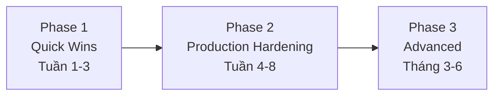

# Agent Deployment Roadmap

Lộ trình 3 phase để áp dụng AI agent vào production, đúc kết từ trải nghiệm thực tế. Nguyên tắc xuyên suốt: **bắt đầu đơn giản, chỉ thêm phức tạp khi cần**. Góc nhìn *adoption* này đi kèm với các quyết định *kiến trúc/hạ tầng*: chọn [[agent-execution-models|execution model]], build [[agent-infrastructure-stack|infrastructure stack]], và tổ chức agent theo [[deployment-topologies|topology]] phù hợp.

## Phase 1: Quick Wins (Tuần 1-3)

- Xác định 2-3 use case bạn đang làm multi-step LLM thủ công.
- Pilot [[crewai|CrewAI]] cho task tạo nội dung có cấu trúc (demo 1 tuần, production-ready 3 tuần).
- Set up **cost monitoring trước mọi thứ khác** (xem [[agent-cost-management]]).
- Bắt đầu document API có thể thành [[mcp|MCP]] server.

## Phase 2: Production Hardening (Tuần 4-8)

- Thêm [[llamaindex|LlamaIndex]] cho xử lý tài liệu và RAG-heavy workflow.
- Cài đặt [[human-in-the-loop|HITL]] pattern cho mọi nội dung đến tay end user.
- Build evaluation framework kết hợp check tự động + review con người.
- Đánh giá [[openai-agents-sdk|OpenAI Agents SDK]] như lựa chọn đơn giản hơn cho dự án mới.

## Phase 3: Advanced (Tháng 3-6)

- Cân nhắc [[autonomy-spectrum|multi-agent]] cho use case thực sự phức tạp.
- Áp dụng [[mcp|MCP]] cho tích hợp tool chuẩn hóa.
- Đánh giá [[a2a|A2A]] cho scenario tích hợp đối tác.
- Khám phá [[ag-ui|AG-UI]] cho giao tiếp frontend-agent chuẩn hóa.

## Điều KHÔNG nên làm

- Đừng bắt đầu với multi-agent — bắt đầu workflow đơn giản và nâng cấp dần.
- Đừng bỏ qua cost monitoring — bạn sẽ hối hận trong tháng đầu.
- Đừng kỳ vọng chất lượng production từ demo — plan 4-6 tháng cho hệ thống agent phức tạp.
- Đừng viết custom integration khi đã có chuẩn — MCP, A2A, AG-UI tồn tại có lý do.

## 7 bài học tổng kết

1. Bắt đầu đơn giản; simple workflow xử lý 80% yêu cầu thực tế.
2. Chi phí là cấp số nhân, không cộng ([[agent-cost-management]]).
3. Đánh giá là vấn đề khó nhất — cần đánh giá **trajectory** (reasoning có hợp lý không), không chỉ output.
4. Guardrails là infrastructure thiết yếu ([[production-reliability]]).
5. Kiến trúc memory quan trọng hơn bạn nghĩ — smart summarization là then chốt.
6. Giai đoạn tinh chỉnh là dự án thật — build ban đầu 20% effort, production 80%.
7. **Narrow agent đánh bại general agent** — hệ thống thành công nhất đều có domain hẹp.

## Xem thêm
- [[agent-frameworks-comparison]] · [[production-reliability]] · [[agent-protocols/index|Agent Protocol Stack]]
- [[deployment-topologies]] · [[agent-infrastructure-stack]] · [[agent-execution-models]] — góc nhìn kiến trúc/hạ tầng bổ sung
- [[deployment-decision-framework]] — map yêu cầu vào pattern kiến trúc
