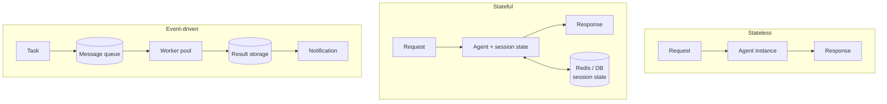

# Agent Execution Models

Quyết định kiến trúc lớn đầu tiên khi đưa agent lên production là chọn **execution model** — cách agent chạy và giữ (hay không giữ) state. Có 3 pattern cốt lõi xuất hiện trong hầu hết deployment.

## Stateless Request-Response

Hoạt động như API truyền thống: mỗi request hoàn toàn mới, không nhớ gì trước đó. Tốt cho **phân tích tài liệu, trích xuất dữ liệu, task classification**.

- **Ưu**: đơn giản; scale ngang bằng cách thêm instance; một instance fail không ảnh hưởng cái khác.
- **Nhược**: không giữ memory giữa các turn → mọi context phải đi kèm trong mỗi request payload.

## Stateful Session-Based

Nhớ những gì đã thảo luận. Chatbot customer service hoặc coding assistant xây trên context cũ. Agent lưu **session state** (lịch sử hội thoại, preference user, intermediate result) trong memory hoặc database.

- **Thách thức chính là state management**: state ở đâu, persist bao lâu, agent crash giữa chừng thì sao?
- Lưu **Redis** cho hội thoại ngắn, database cho persist lâu dài.
- Load balancer cần **session affinity** (route user về cùng instance) — hoặc externalize state để mọi instance truy cập được (xem [[deployment-topologies|Agent Pools]]).
- Đây cũng là lớp nơi [[context-window-management|context overflow]] và smart summarization trở nên thiết yếu với hội thoại dài.

## Event-Driven Asynchronous

Phản ứng với **event** chứ không phải request trực tiếp. User submit task phức tạp, được ack ngay, nhận notification khi xong. Agent kéo work từ message queue, xử lý (nhiều tool call + reasoning kéo dài), rồi publish kết quả.

- **Ưu**: xử lý workflow chạy dài mà không block interface.
- **Nhược**: phức tạp — phải quản lý message queue, worker pool, result storage, notification system.

## Trộn pattern trong thực tế

**Hầu hết hệ thống production trộn cả ba.** Ví dụ nền tảng customer service: stateless cho FAQ, stateful cho hội thoại support, event-driven cho điều tra case phức tạp. Việc chọn model không loại trừ nhau mà theo từng luồng nghiệp vụ.

Chọn model nào phụ thuộc yêu cầu về scaling, state, và budget — xem [[deployment-decision-framework]].

## Xem thêm
- [[agent-infrastructure-stack]] — 5 layer hạ tầng support các model này
- [[deployment-topologies]] — cách tổ chức agent ở scale
- [[deployment-decision-framework]] — map yêu cầu vào execution model
- [[agent-deployment-roadmap]] — lộ trình đưa agent vào production
