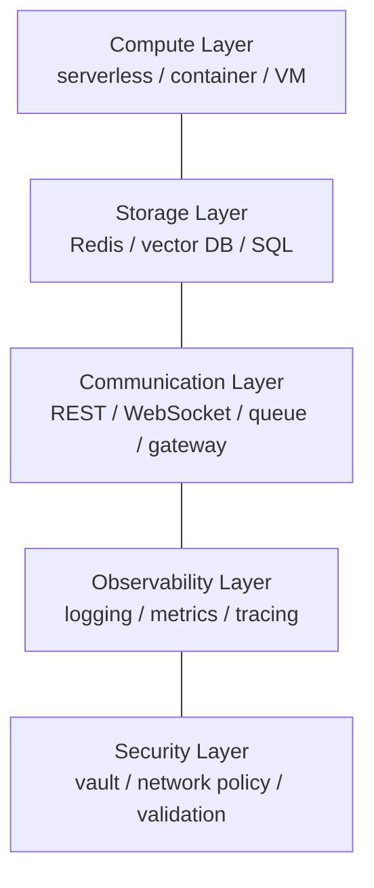

# Agent Infrastructure Stack

Một production agent cần **5 lớp hạ tầng**. Mỗi layer có lựa chọn công nghệ riêng và đánh đổi đi kèm.

## Compute Layer — nơi code agent chạy

- **Serverless function (AWS Lambda, Google Cloud Run)**: tốt cho stateless agent với traffic không đoán được; giảm idle cost nhưng có latency (cold start).
- **Containerized (ECS, Kubernetes)**: phù hợp stateful agent cần môi trường nhất quán; cần orchestration.
- **Dedicated VM**: cho volume cao nơi cold start không chấp nhận được; kiểm soát tối đa với phức tạp tối đa.

Ánh xạ trực tiếp với [[agent-execution-models|execution model]]: serverless ↔ stateless, container ↔ stateful.

## Storage Layer — state tạm thời và bền vững

- **Temporary storage**: lịch sử hội thoại trong session active. **Redis** xuất sắc nhờ tốc độ và auto-expire.
- **Persistent storage**: memory dài hạn, lịch sử tool call, dữ liệu evaluation.
- **Vector database (Pinecone, Weaviate)**: lưu embedding cho semantic memory.
- **Traditional database**: dữ liệu có cấu trúc.

Memory system tăng độ phức tạp — chỉ persist thứ thực sự cần.

## Communication Layer — kết nối agent với thế giới ngoài

- **REST API**: synchronous request-response.
- **WebSocket**: streaming response real-time cho conversational agent.
- **Message queue (RabbitMQ, AWS SQS)**: điều phối workflow async và multi-agent (nền của [[agent-execution-models|event-driven model]]).
- **API gateway**: ngồi trước agent, xử lý auth, rate limit, routing.

Bao gồm cả tích hợp đến tool/service ngoài — mỗi cái cần credential management, error handling, retry logic (liên quan [[silent-tool-call-failures|xử lý lỗi tool call]]).

## Observability Layer — nhìn vào hành vi agent

- **Structured logging**: reasoning process, tool call, decision.
- **Metrics**: success rate, latency, token usage.
- **Distributed tracing**: theo dõi request qua workflow multi-agent.

Dùng **LangSmith, LangFuse**, hoặc custom — capture dữ liệu agent-specific mà APM truyền thống bỏ qua. Không có observability, debug hành vi LLM gần như bất khả thi. Xem [[agent-observability]] cho chi tiết span-level tracing và cost attribution.

## Security Layer — kiểm soát access, bảo vệ dữ liệu

- **API key** trong vault (AWS Secrets Manager, HashiCorp Vault), **không** trong biến môi trường.
- **Network policy** giới hạn agent access.
- **Input validation** ngăn [[production-reliability|prompt injection]].
- **Output filtering** bắt thông tin nhạy cảm.
- Xử lý compliance về data retention và audit trail (xem [[production-reliability|bảo mật & compliance]]).

> **Production example — Palana (Grab)**: khi agent chạy tự chủ ở scale, Security layer cần **containment ở tầng hạ tầng**, không chỉ input/output filter. [[grab-palana-secure-agent-platform|Palana]] cô lập mỗi agent (namespace/RBAC/storage riêng), dùng **proxy-only secrets** (agent chỉ thấy placeholder token), egress qua **Envoy có policy**, và giữ **control plane ngoài agent process** để agent bị compromise không tắt được safeguard.

## Xem thêm
- [[grab-palana-secure-agent-platform]] · 📖 [[articles/grab-palana-secure-agent-platform]] — containment agent tầng hạ tầng (Kubernetes-native)
- [[agent-execution-models]] — model quyết định lựa chọn Compute/Storage
- [[deployment-topologies]] — topology quyết định nhu cầu Communication
- [[agent-observability]] — chi tiết Observability layer
- [[production-reliability]] — chi tiết Security & compliance
