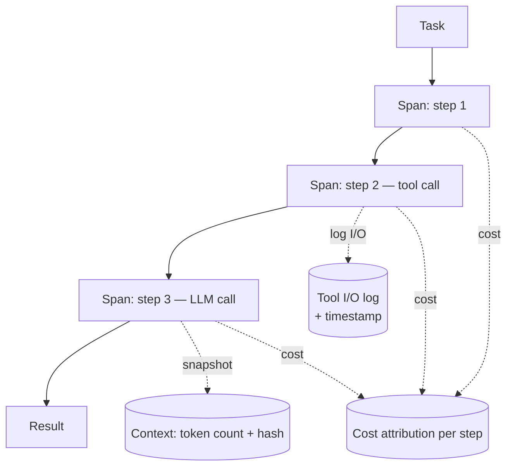

# Agent Observability

Khoảng trống observability biến debug từ **giờ thành ngày**, và từ "tìm ra root cause" thành "chúng tôi đoán có thể là...". Với agent, application monitoring chuẩn **không đủ**.

## Vì sao monitoring chuẩn không đủ

Bạn có thể có uptime metric hoàn hảo, error rate, latency histogram — mà vẫn không biết tại sao một agent task cụ thể cho kết quả sai. Agent cần **execution trace**: bản ghi có cấu trúc về *causality*, không chỉ event. Cần trả lời được:

- Context nào được pass ở mỗi bước?
- Model đã reasoning gì?
- Tool nào được gọi, thứ tự nào, input gì, trả về gì?
- Đâu trong chain output bắt đầu lệch khỏi hành vi mong đợi?

Khoảng trống phổ biến nhất là **vắng step-level trace**: team instrument entry point (task received) và exit point (result returned), không có gì ở giữa. Khi fail, trace chỉ cho: `task started, result: failure`.

> **Đó không phải observability. Đó là black box với một cái alarm.**

## Observability tối thiểu cho production agent

- **Span-level tracing** — mỗi agent step là một span với quan hệ parent-child tái tạo execution tree. Dùng span **[[opentelemetry|OpenTelemetry]]-compatible**.
- **Logging input/output mỗi tool call** — full request và response, có timestamp. Đúng là dài; đúng là bạn cần.
- **Context snapshot tại điểm quyết định** — token count và hash của context tại mỗi LLM call, để tái tạo được những gì model thấy khi failure xảy ra.
- **Cost attribution per task** — token spend chia theo step, xác định phần nào của workflow tiêu budget không cân xứng (feed vào [[agent-cost-management]]).

## Vai trò trong hệ thống

Execution trace là công cụ bộc lộ [[silent-tool-call-failures|silent tool call failures]] và [[context-window-management|context overflow]] — những failure vốn vô hình. Không có step-level trace thì debug production failure gần như bất khả thi (xem [[harness-checklist|ưu tiên #3]]).

## Xem thêm
- [[opentelemetry]] — chuẩn tracing được khuyến nghị
- [[harness-engineering]] · [[silent-tool-call-failures]] · [[agent-cost-management]]
- [[production-reliability]] — audit trail cho compliance
