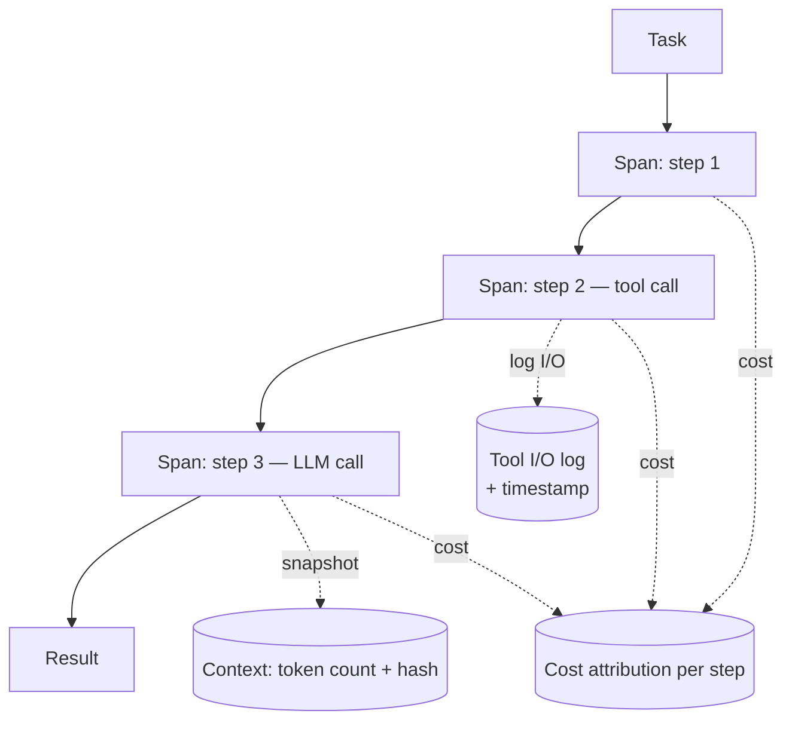

# Agent Observability

Khoảng trống observability biến debug từ **giờ thành ngày**, và từ "tìm ra root cause" thành "chúng tôi đoán có thể là...". Với agent, application monitoring chuẩn **không đủ**.

## Vì sao monitoring chuẩn không đủ

Bạn có thể có uptime metric hoàn hảo, error rate, latency histogram — mà vẫn không biết tại sao một agent task cụ thể cho kết quả sai. Agent cần **execution trace**: bản ghi có cấu trúc về *causality*, không chỉ event. Cần trả lời được:

- Context nào được pass ở mỗi bước?
- Model đã reasoning gì?
- Tool nào được gọi, thứ tự nào, input gì, trả về gì?
- Đâu trong chain output bắt đầu lệch khỏi hành vi mong đợi?

Khoảng trống phổ biến nhất là **vắng step-level trace**: team instrument entry point (task received) và exit point (result returned), không có gì ở giữa. Khi fail, trace chỉ cho: `task started, result: failure`.

> **Đó không phải observability. Đó là black box với một cái alarm.**

## Observability tối thiểu cho production agent

- **Span-level tracing** — mỗi agent step là một span với quan hệ parent-child tái tạo execution tree. Dùng span **[[opentelemetry|OpenTelemetry]]-compatible**.
- **Logging input/output mỗi tool call** — full request và response, có timestamp. Đúng là dài; đúng là bạn cần.
- **Context snapshot tại điểm quyết định** — token count và hash của context tại mỗi LLM call, để tái tạo được những gì model thấy khi failure xảy ra.
- **Cost attribution per task** — token spend chia theo step, xác định phần nào của workflow tiêu budget không cân xứng (feed vào [[agent-cost-management]]).

## Vai trò trong hệ thống

Execution trace là công cụ bộc lộ [[silent-tool-call-failures|silent tool call failures]] và [[context-window-management|context overflow]] — những failure vốn vô hình. Không có step-level trace thì debug production failure gần như bất khả thi (xem [[harness-checklist|ưu tiên #3]]).

## Audit trail cho ngành regulated (production)

Trong ngành regulated, execution trace không chỉ để debug mà còn là **bằng chứng compliance**. [[stripe-financial-compliance-agents|Stripe]] log toàn bộ lịch sử thực thi agent — mọi action, decision và rationale — để đứng vững trước examination của cơ quan quản lý. Chính cấu trúc [[react-pattern|ReAct]] (`tool invocation → observation → reasoning`) tạo ra trace tự nhiên cho mục đích này.

## Bốn loại span và vòng trace → eval (thực hành)

Bổ sung từ guide [[agent-observability-guide-braintrust|Braintrust 2026]]: một schema trace tối thiểu cho agent gồm **4 loại span** — mỗi loại bắt một failure mode riêng:

| Span | Ghi gì | Bắt failure gì |
|---|---|---|
| **Tool-Call** | name, arguments, output, duration, retry, error | hallucinated arguments, silent retry loop ([[silent-tool-call-failures]]) |
| **Reasoning** | plan / action / observation / next | plan drift, chọn sai nhánh |
| **State Transition** | working memory trước-sau + handoff payload | context loss ([[context-window-management]]) |
| **Memory Operation** | query, entries, relevance score, freshness | stale read, memory leakage |

Điểm mấu chốt về multi-agent: xem **mỗi agent boundary như một RPC** — ghi handoff payload thành span trên parent, nest sub-agent dưới đó, cho cùng trace ID chảy qua; nếu không, handoff failure hoàn toàn vô hình.

Và quan trọng nhất, trace không chỉ để debug: trace **fail online scoring → chuyển thành eval case**, rồi CI gate (GitHub Action) block merge nếu quality tụt — đây là hiện thực hoá [[evaluation-pipeline|continuous evaluation]]. Landscape platform: [[braintrust|Braintrust]] (trace-to-eval), Galileo AI (guardrails), Arize Phoenix (OSS, [[opentelemetry|OTEL]]-first), Datadog (APM).

## Đã thành thực hành chuẩn (số liệu 2026)

Khảo sát [[state-of-agent-engineering-langchain|State of Agent Engineering]] (LangChain, n=1.340) cho thấy observability không còn là "nice-to-have": **89%** tổ chức đã triển khai; với production agent lên **94%**, trong đó **71,5%** có full tracing và **62%** giữ trace chi tiết ở mức step + tool call. Nói cách khác, step-level trace mô tả ở trên chính là mức tối thiểu mà đa số team production đã đạt.

## Xem thêm
- [[state-of-agent-engineering-langchain]] · 📖 [[articles/state-of-agent-engineering-langchain]] — 89%/94%/71,5% adoption observability
- [[agent-observability-guide-braintrust]] · 📖 [[articles/agent-observability-guide-braintrust]] — 4 loại span, APM vs agent-observability, code LangGraph+Mastra
- [[braintrust]] — platform trace-to-eval
- [[evaluation-pipeline]] — trace fail nuôi eval case
- [[opentelemetry]] — chuẩn tracing được khuyến nghị
- [[stripe-financial-compliance-agents]] · [[agent-service-architecture]] — audit trail agent cho financial compliance
- [[agent-infrastructure-stack]] — observability là một trong 5 layer của hạ tầng agent (logging / metrics / distributed tracing)
- [[harness-engineering]] · [[silent-tool-call-failures]] · [[agent-cost-management]]
- [[production-reliability]] — audit trail cho compliance
