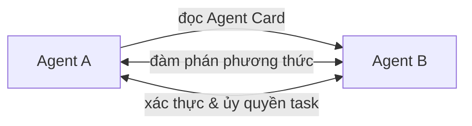

# A2A — Agent-to-Agent Protocol

**A2A (Agent-to-Agent Protocol)** do [[google|Google]] ra mắt 4/2025 và đóng góp cho Linux Foundation 6/2025. A2A giải quyết vấn đề: **cách agent từ các tổ chức khác nhau giao tiếp** với nhau.

Hơn **150 tổ chức** hỗ trợ, gồm Salesforce, SAP, ServiceNow, Atlassian.

## Agent Cards

A2A giới thiệu khái niệm **Agent Cards** — file JSON mô tả khả năng của agent, giống như card thông tin cho AI. Cơ chế:

- Agent **discover** lẫn nhau qua Agent Cards
- **Đàm phán** phương thức tương tác
- **Xác thực và ủy quyền** task
- Chạy trên HTTP, SSE, JSON-RPC

## So sánh với MCP

| Protocol | Mục đích | Phép so sánh |
|---|---|---|
| [[mcp]] | Agent ↔ Tool | Cách agent nói chuyện với API/DB |
| **A2A** | Agent ↔ Agent | Cách agent từ các tổ chức cộng tác |

Điểm khác biệt: MCP là agent gọi tool (quan hệ client-server), còn A2A là hai agent ngang hàng từ các tổ chức khác nhau cộng tác.

## Xem thêm
- [[agent-protocols/index|Agent Protocol Stack]] — bức tranh tổng thể
- [[mcp]] · [[ag-ui]]
- [[agent-deployment-roadmap]] — A2A được đánh giá ở Phase 3 cho tích hợp đối tác
