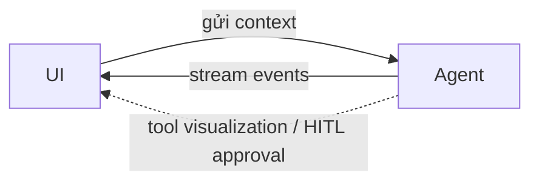

# AG-UI — Agent-User Interaction Protocol

**AG-UI (Agent-User Interaction Protocol)** do [[copilotkit|CopilotKit]] ra mắt 5/2025. AG-UI giải quyết khoảng trống cuối cùng trong stack protocol: **cách agent giao tiếp với UI**.

## Đặc điểm

- Protocol dựa trên **event** qua HTTP/WebSocket, với khoảng **17 event type chuẩn**
- **Hai chiều**: UI gửi context đến agent, agent stream lại về UI
- Hỗ trợ built-in cho: streaming, đồng bộ state, tool visualization, và [[human-in-the-loop|HITL approval]]
- Đã tích hợp với [[langgraph|LangGraph]], [[crewai|CrewAI]], Mastra, Microsoft Agent Framework

## Vai trò trong stack

AG-UI là mảnh ghép giao tiếp người-agent, bổ trợ cho [[mcp|MCP]] (agent-tool) và [[a2a|A2A]] (agent-agent). Nó đặc biệt quan trọng cho các pattern [[human-in-the-loop|HITL]] cần feedback real-time và approval workflow ngay trên giao diện người dùng.

## Xem thêm
- [[agent-protocols/index|Agent Protocol Stack]] — bức tranh tổng thể
- [[mcp]] · [[a2a]]
- [[human-in-the-loop]] — AG-UI hỗ trợ approval gate ở tầng UI
