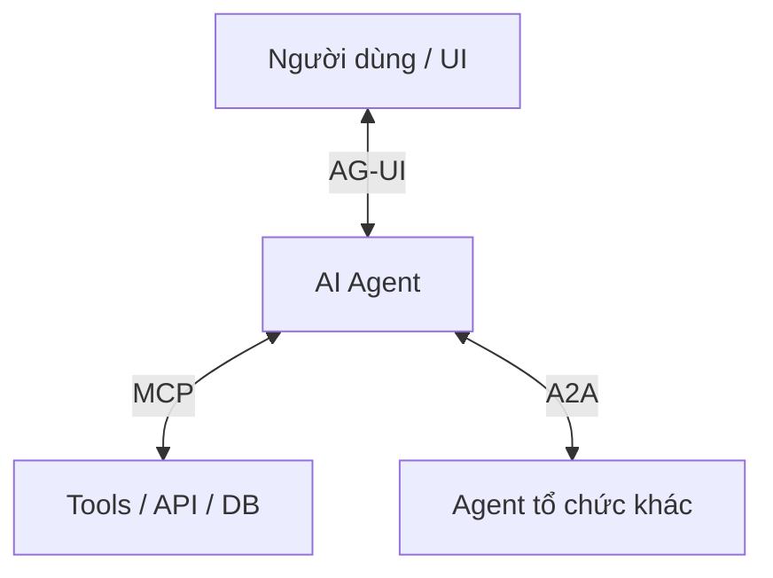

# Agent Protocol Stack

Ngoài framework, năm 2025 chứng kiến sự xuất hiện của các **protocol chuẩn hóa** định hình cách agent được xây dựng và kết nối. Ba protocol chính bổ trợ nhau, mỗi cái giải quyết một khoảng trống kết nối khác nhau.

| Protocol | Kết nối | Vai trò |
|---|---|---|
| [[mcp|MCP]] | Agent ↔ Tool | Cách agent nói chuyện với API/DB |
| [[a2a|A2A]] | Agent ↔ Agent | Cách agent từ các tổ chức cộng tác |
| [[ag-ui|AG-UI]] | Agent ↔ UI | Cách agent giao tiếp với người dùng |

## Các sub-page

- [[mcp|MCP — Model Context Protocol]] — chuẩn kết nối agent với tool (Anthropic, cuối 2024)
- [[a2a|A2A — Agent-to-Agent Protocol]] — chuẩn cho agent liên tổ chức (Google, 2025)
- [[ag-ui|AG-UI — Agent-User Interaction Protocol]] — chuẩn giao tiếp agent-UI (CopilotKit, 2025)

## Chúng kết hợp thế nào

- **MCP** kết nối tool (DB, API, search)
- **A2A** cộng tác với agent ngoài (đối tác, service chuyên biệt)
- **AG-UI** giao tiếp với người dùng (feedback real-time, approval workflow)

Đội nào áp dụng chuẩn này sớm sẽ tốn ít thời gian cho custom integration và nhiều thời gian hơn cho sản phẩm thực sự. Dự báo 2026: ba protocol này sẽ hội tụ thành **infrastructure chuẩn**.

## Xem thêm
- [[agent-deployment-roadmap]] — protocol được áp dụng ở Phase 3
- [[production-reliability]] — vai trò của MCP trong tích hợp kiến trúc hiện có
