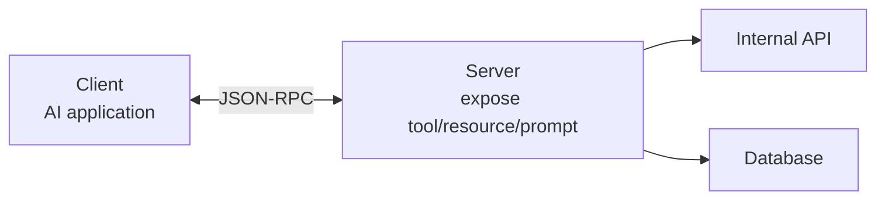

# MCP — Model Context Protocol

**MCP (Model Context Protocol)** do [[anthropic|Anthropic]] phát hành cuối 2024, là chuẩn cho cách agent kết nối với **tool**. Hãy nghĩ nó như **"USB cho AI tool"** — cách chuẩn hóa để bất kỳ agent nào discover và sử dụng bất kỳ tool nào, không cần code tích hợp custom.

## Kiến trúc

- **Server** expose tool, resource, và prompt
- **Client** là AI application sử dụng các capability đó
- **Protocol** dùng JSON-RPC chuẩn
- Đã được hỗ trợ bởi Claude Desktop, Cursor, Zed — và đang phát triển nhanh

## Tại sao quan trọng

Nếu bạn build một MCP server cho internal API, **mọi MCP-compatible agent đều dùng được**. Thay vì viết custom connector cho từng framework, bạn implement một lần.

Điều này đặc biệt giá trị cho team có kiến trúc microservices: MCP cung cấp cách chuẩn expose microservice cho agent (xem [[production-reliability|tích hợp với kiến trúc hiện có]]).

## So sánh với protocol khác

| Protocol | Mục đích |
|---|---|
| **MCP** | Agent ↔ Tool — cách agent nói chuyện với API/DB |
| [[a2a]] | Agent ↔ Agent |
| [[ag-ui]] | Agent ↔ UI |

## Xem thêm
- [[agent-protocols/index|Agent Protocol Stack]] — bức tranh tổng thể
- [[a2a]] · [[ag-ui]]
