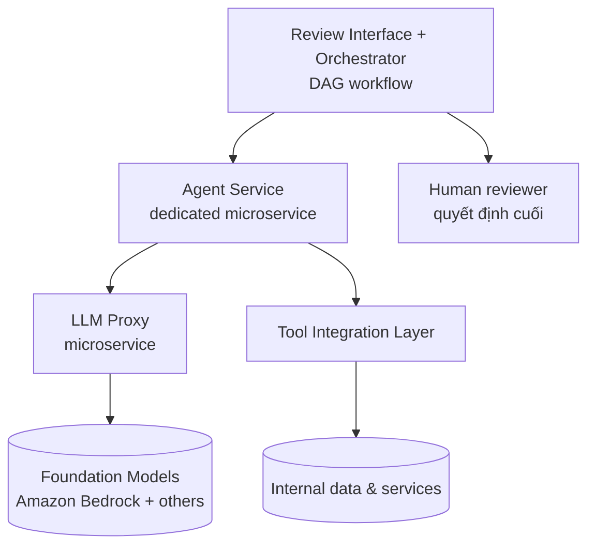

# Agent Service Architecture

Khi đưa agent vào production ở scale, một quyết định hạ tầng cốt lõi là: **agent có nên dùng lại hệ thống ML inference cũ không?** Case study [[stripe-financial-compliance-agents|Stripe]] (2026) trả lời dứt khoát là **không** — agent có resource profile khác hẳn model ML truyền thống và cần một **dedicated agent service**. Trang này tổng hợp pattern kiến trúc từ một triển khai production thực tế (>100 agent, chưa đầy 1 năm).

## Vì sao agent cần microservice riêng (không tái dùng ML inference)

| Khía cạnh | ML inference truyền thống | Agentic system |
|---|---|---|
| **Resource profile** | Compute-bound (GPU/large memory) | **Network-bound** — chờ foundation model + tool call |
| **Latency** | Xác định, ổn định | **Bất định** — phụ thuộc số vòng ReAct tool call (xem [[react-pattern]]) |
| **API** | Output type cơ bản, stateless | Cần schema linh hoạt để annotate kết quả + giữ **stateful conversation** |

Vì agent chủ yếu **chờ I/O** (không đốt GPU), việc nhét chung vào cluster ML compute-bound gây lãng phí và tắc nghẽn. Stripe tách agent service ra, tiến hóa từ endpoint stateless synchronous ban đầu thành hệ thống multi-turn conversational, mở rộng lên **hơn 100 agent trong chưa đầy một năm**.

## 4 thành phần kiến trúc

1. **Review Interface & Orchestrator** — điểm điều phối trung tâm, quản lý investigation như một DAG (xem dưới); pipe câu trả lời của reviewer làm context cho câu hỏi sau.
2. **Agent Service** — microservice chuyên biệt chạy vòng lặp agent, hỗ trợ conversation stateful multi-turn.
3. **LLM Proxy microservice** — xem mục riêng bên dưới.
4. **Tool Integration Layer** — agent gọi tool để truy cập dữ liệu/dịch vụ nội bộ động, vì "tập tín hiệu liên quan tiềm năng thường lớn hơn nhiều so với những gì nhét vừa trong một prompt".

## LLM Proxy: một điểm truy cập foundation model chuẩn hóa

Thay vì mỗi team gọi API model trực tiếp, mọi truy cập đi qua một **LLM Proxy**:

- **Noisy neighbor protection** — chống tranh chấp tài nguyên khi nhiều team cùng gọi LLM.
- **Unified API** — một endpoint trừu tượng hóa nhiều foundation model và capability; **đổi model chỉ cần đổi một argument**.
- **Model fallback** — tự động dùng model dự phòng khi thiếu tài nguyên hoặc lỗi.
- **Monitoring & authentication** — track usage để forecast tài nguyên và chọn model phù hợp; nền tảng cho [[agent-cost-management|cost instrumentation]].

Proxy hỗ trợ prompt caching và tool calling xuyên nhiều foundation model (Amazon Bedrock và các nhà cung cấp khác).

## Task decomposition bằng DAG

Thay vì giao cả một review phức tạp cho một agent, Stripe **chia nhỏ investigation thành các sub-task ghép được, tổ chức thành DAG**. Mỗi sub-task:

- Có **scope giới hạn** (bite-sized) để chống agent lệch focus và vừa working memory.
- Có thể **phụ thuộc kết quả** của sub-task khác (cạnh trong DAG).
- Là một **"rail"** đã được đo chất lượng qua testing, đảm bảo review phủ hết các điểm compliance bắt buộc.

Quan trọng: hệ thống **không tin tuyệt đối vào output agent** — response chỉ là thông tin bổ trợ, [[human-in-the-loop|reviewer con người]] vẫn phải tự trả lời từng sub-task.

## Bài học hạ tầng

- **Infrastructure-first**: kiến trúc microservice riêng là yếu tố biến agent "từ prototype thí nghiệm thành production service hỗ trợ >100 agent".
- **Cost instrumentation** track token/invocation giúp forecast chi tiêu và phát hiện điểm tối ưu **trước khi** vượt ngân sách (bổ trợ [[agent-cost-management|CostEnvelope hard limit]]).
- **Async + DAG** là thiết yếu cho tương tác agent phức tạp mà vẫn giữ auditability và [[human-in-the-loop|human oversight]] ở scale.

## Xem thêm
- [[stripe-financial-compliance-agents]] — case study nguồn
- [[agent-execution-models]] — Stateless → Stateful → Event-driven (agent service của Stripe đi đúng lộ trình này)
- [[agent-infrastructure-stack]] — 5-layer stack; agent service nằm ở Compute + Communication layer
- [[react-pattern]] — vòng lặp mà agent service thực thi
- [[deployment-decision-framework]] — khi nào cần microservice riêng
