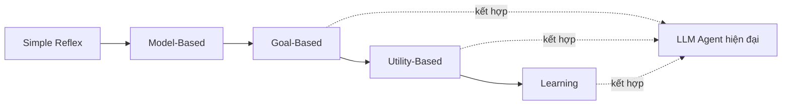

# AI Agent Types

Một **AI agent** là phần mềm có thể: nhận biết môi trường, lý luận để quyết định hành động, hành động để đạt mục tiêu, và học từ phản hồi. Khác biệt cốt lõi so với chatbot là **tính tự chủ (autonomy)** — chatbot trả lời câu hỏi, còn agent hoàn thành nhiệm vụ.

## 5 loại agent (phân loại học thuật)

| Loại | Cách hoạt động | Ví dụ |
|---|---|---|
| **Simple Reflex** | Luật if-then, không có bộ nhớ | Bộ điều nhiệt, bộ lọc spam |
| **Model-Based** | Duy trì trạng thái nội bộ, theo dõi context | Hệ thống điều hướng nhớ vị trí |
| **Goal-Based** | Lập kế hoạch để đạt mục tiêu | GPS tìm đường nhanh nhất |
| **Utility-Based** | Tối ưu kết quả tốt nhất trong các lựa chọn | Hệ thống gợi ý Netflix |
| **Learning** | Cải thiện hiệu suất theo thời gian | Alexa hiểu bạn tốt hơn theo thời gian |

## LLM agent hiện đại thuộc loại nào?

Hầu hết LLM agent hiện đại là **sự kết hợp của goal-based, utility-based và learning**: chúng lập kế hoạch, tối ưu các lựa chọn, và cải thiện dần. Về mặt cơ chế vận hành, chúng triển khai vòng lặp [[react-pattern|ReAct]] (Reasoning + Acting) và nằm ở các mức khác nhau trên [[autonomy-spectrum|phổ autonomy]].

Việc phân loại này chủ yếu mang tính khái niệm — nó giúp hình dung các năng lực mà một LLM agent hiện đại phải kết hợp, hơn là một khuôn khổ kỹ thuật để chọn framework. Để chọn kiến trúc thực tế, xem [[autonomy-spectrum]] và [[agent-frameworks-comparison]].

## Xem thêm
- [[react-pattern]] — cơ chế tư duy của agent hiện đại
- [[autonomy-spectrum]] — 4 level tự chủ trong thực tế
