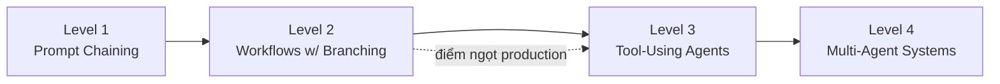

# Autonomy Spectrum

"AI agent" **không phải là một phân loại nhị phân**. Có một phổ autonomy (mức độ tự chủ), và biết use case của bạn nằm ở đâu trên phổ này sẽ quyết định framework — và độ phức tạp — bạn thực sự cần.

## Level 1: Prompt Chaining

Luồng tuyến tính — input đến LLM, output feed vào lần gọi LLM khác, cứ thế tiếp tục. Deterministic, dễ đoán, dễ debug.

Ví dụ: tạo câu hỏi phỏng vấn từ JD, rồi tạo rubric đánh giá từ câu hỏi đó. "Nó hoạt động. Nhàm chán. Và nhàm chán là tốt trong production."

## Level 2: Workflows with Branching

Logic điều kiện dựa trên output LLM. Hệ thống ra quyết định, nhưng **mọi nhánh đều được định nghĩa sẵn**.

Ví dụ: tạo nội dung với kiểm tra chất lượng — nếu nội dung dưới ngưỡng chất lượng, nó loop lại để sửa.

## Level 3: Tool-Using Agents

LLM **quyết định gọi tool nào**. Đây là nơi [[react-pattern|pattern ReAct]] xuất hiện. Tự chủ hơn, nhưng vẫn là single agent.

Ví dụ: một research agent quyết định search web, query database, hay hỏi câu hỏi làm rõ.

## Level 4: Multi-Agent Systems

Nhiều agent chuyên biệt cộng tác — một agent research, một agent viết, một agent review. Đây là level **phức tạp nhất, mạnh mẽ nhất, và khó đoán nhất**. Cũng là nơi chi phí bùng nổ (xem [[agent-cost-management]]) và debug trở nên thực sự khó khăn.

## Khuyến nghị cho production

Với hầu hết use case production hiện nay, **Level 2-3 là điểm ngọt (sweet spot)**. Level 4 hấp dẫn cho demo nhưng đau đớn cho production.

Ánh xạ với [[production-reliability|mức độ production-ready]]:

| Level | Production Ready? |
|---|---|
| Level 1-2 (Simple Workflows) | Có |
| Level 3 (Tool-Using) | Có, với guardrail |
| Level 4 có cấu trúc | Cẩn trọng có |
| Level 4 open-ended | Chưa |

## Xem thêm
- [[react-pattern]] — cơ chế cho Level 3+
- [[agent-frameworks-comparison]] — framework phù hợp cho từng level
- [[agent-cost-management]] — vì sao Level 4 tốn kém
