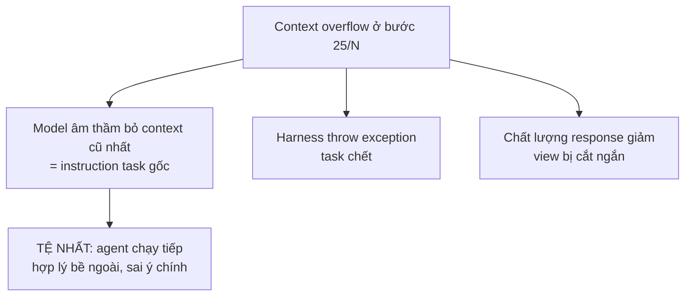

# Context Window Management

**Context window overflow xảy ra ở chính task quan trọng nhất.** Các task agent mang lại giá trị cao nhất — operation multi-step phức tạp trên tài liệu lớn, workflow chạy dài, deep research — cũng là task dễ chạm giới hạn context window nhất. Không phải trùng hợp: độ phức tạp và tiêu thụ context tỉ lệ với nhau.

## Failure mode tinh tế

Agent sâu trong task 25 bước chạm trần context. Tùy cách harness xử lý overflow, một trong ba điều xảy ra:

Cả ba đều tệ. Cái đầu tệ nhất vì agent tiếp tục thực thi mà không có task context cần thiết.

## 3 thành phần của context engineering hiệu quả

**1. Theo dõi token budget mỗi agent step.** Trước mỗi LLM call, tính token count ước tính của full context. Nếu trong khoảng **15-20% giới hạn**, kích hoạt summarization/truncation **trước** khi proceed — không phải sau khi đã overflow. (Xem [[harness-checklist|context budget tracking]].)

**2. Context tier có cấu trúc.** Không phải mọi context đều quan trọng như nhau:

| Tier | Nội dung | Retention |
|---|---|---|
| Permanent | Task specification | Không bao giờ cắt |
| Working | Tool call result mới nhất | Giữ, ưu tiên cao |
| Archivable | Background document load đầu session | Có thể tóm tắt/nén |

**3. Checkpoint-resume tại context boundary.** Nếu task quá lớn để hoàn thành trong một context window: thiết kế workflow checkpoint tại boundary tự nhiên, serialize agent state, resume trong context mới với summary compact. Thách thức: summary phải giữ đủ **độ trung thực** để agent tiếp tục coherent. Đây là pattern duy nhất xử lý task long-horizon đáng tin cậy.

## Liên hệ với 47Billion

Bài học này cộng hưởng với case study bảo hiểm ở [[production-reliability]]: "hội thoại dài phá vỡ mọi thứ" — session 30-45 phút cần **smart summarization** (giữ context quan trọng, cắt trao đổi dư thừa). Đây chính là context tier + budget tracking áp dụng vào hội thoại.

## Xem thêm
- [[harness-engineering]] · [[harness-checklist]] · [[agent-observability]]
- [[production-reliability]] — smart summarization cho hội thoại dài
