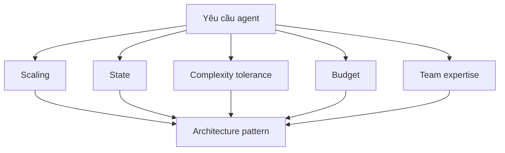

# Deployment Decision Framework

Chọn kiến trúc deployment đúng nghĩa là **map yêu cầu thực tế vào pattern kiến trúc** — không phải dùng công nghệ mới nhất hay pattern phức tạp nhất. Framework này gom 5 chiều quyết định để chọn [[agent-execution-models|execution model]], [[deployment-topologies|topology]], và lựa chọn trong [[agent-infrastructure-stack|infrastructure stack]].

## 1. Bắt đầu với yêu cầu scaling

- **< 100 request/giờ, traffic rời rạc** → serverless [[agent-execution-models|stateless]] agent (giảm idle cost).
- **Hàng ngàn hội thoại đồng thời, latency dưới giây** → containerized [[agent-execution-models|stateful]] agent với compute dedicated.
- **Task xong trong giây trong khi task khác mất hàng giờ** → [[agent-execution-models|event-driven pattern]] để tránh blocking và dùng resource tốt hơn.

## 2. Cân nhắc yêu cầu state

- Mỗi request độc lập (phân tích tài liệu, classification) → **stateless**.
- User mong "nhớ những gì đã nói" → **stateful session** với storage phù hợp (Redis / DB).
- Task multi-step kéo dài phút hoặc giờ → **event-driven** với persistent state.

## 3. Đánh giá khả năng chịu phức tạp

Single [[deployment-topologies|stateless agent]] đơn giản nhất để deploy và debug. [[deployment-topologies|Multi-agent]] cho linh hoạt và chuyên môn hóa nhưng **nhân lên** độ phức tạp vận hành. Nguyên tắc: bắt đầu đơn giản, đo lường, chỉ thêm phức tạp khi approach đơn giản không đáp ứng (đồng thuận với [[agent-deployment-roadmap]]).

## 4. Tính budget

Token economics áp dụng trực tiếp vào kiến trúc (xem [[agent-cost-management]]):

- Serverless function wake up mỗi request có thể gây LLM call không cần thiết khi init.
- Long-running container có thể **cache embedding** và giảm computation lặp.
- Event-driven **batch** request tương tự để giảm token usage.

## 5. Yếu tố expertise của team

- Có DevOps engineer kinh nghiệm → **Kubernetes** cho linh hoạt tối đa.
- Team nhỏ → managed service (**Cloud Run, AWS Fargate**) trừu tượng hóa độ phức tạp hạ tầng.

> **Kiến trúc tốt nhất là cái team bạn thực sự vận hành được.** Agent ship được đánh bại kiến trúc hoàn hảo không bao giờ deploy.

## Xem thêm
- [[agent-execution-models]] · [[deployment-topologies]] · [[agent-infrastructure-stack]]
- [[agent-deployment-roadmap]] — lộ trình từng phase đưa agent vào production
- [[agent-cost-management]] — kiến trúc ảnh hưởng trực tiếp cost vận hành
