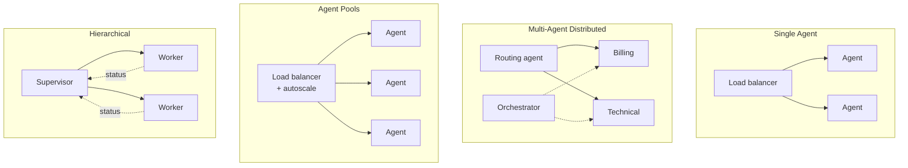

# Deployment Topologies

Cách tổ chức agent trên production phụ thuộc **độ phức tạp task** và **yêu cầu volume**. Có 4 topology chính, cộng một pattern human oversight cắt ngang tất cả. **Chọn topology ảnh hưởng trực tiếp đến nhu cầu [[agent-infrastructure-stack|hạ tầng]].**

## Single Agent Deployment

Xử lý **một capability cụ thể**: agent phân tích tài liệu (PDF → dữ liệu có cấu trúc), agent generation SQL (ngôn ngữ tự nhiên → query). Đây là hiện thân đơn giản nhất của một [[ai-agent-types|tool-using agent]] — dễ phát triển, test, maintain. Deploy nhiều instance sau load balancer để scale.

- **Hạn chế**: scope — không xử lý được workflow cần nhiều capability.

## Multi-Agent Distributed System

Chia task phức tạp cho các agent **chuyên biệt**. Ví dụ customer service: routing agent phân loại inquiry, specialist agent cho billing/technical/account, cộng orchestrator điều phối response.

- **Ưu**: linh hoạt — scale từng specialist độc lập theo demand.
- **Nhược**: cần orchestration cẩn thận để ngăn **cascading failure** và quản lý **token cost khi agent nói chuyện với nhau** (xem [[agent-cost-management]]).

## Agent Pools with Load Balancing

Volume cao, nhiều agent **giống nhau** xử lý request tương tự. Ví dụ 10 instance customer support sau load balancer; auto-scaling policy thêm/bớt instance dựa trên **queue depth** hoặc **response latency**.

- **Thách thức**: quản lý tương tác [[agent-execution-models|stateful]] — dùng **sticky session** (route về cùng instance) hoặc **externalize session state** (mọi instance xử lý mọi request).

## Hierarchical Agent System

Pattern **supervisor-worker** cho workflow phức tạp: supervisor chia task, ủy quyền cho worker chuyên biệt, monitor tiến độ, tổng hợp kết quả. Worker báo cáo status và kết quả trung gian.

- Tốt cho research task, pipeline data analysis, content generation nơi **quality review thiết yếu**.
- Supervisor cài retry logic, quality check, error recovery mà không làm phức tạp logic worker.

## Human Oversight Pattern

Bất kể topology, quyết định **rủi ro cao** thường cần con người duyệt. Workflow semi-autonomous dừng tại **critical decision point** (giao dịch tài chính, khuyến nghị y tế, văn bản pháp lý) và chờ duyệt qua webhook/API.

- Cần **stateful orchestration** duy trì status "pending" hàng giờ hoặc ngày trong khi giữ full execution context.
- Phổ biến trong healthcare, financial service, legal — nơi quyết định tự chủ mang rủi ro lớn hoặc liên quan compliance.
- Đây chính là hiện thân kiến trúc của [[human-in-the-loop|HITL]], và là checkpoint cần thiết cho progressive rollout của các hệ thống rủi ro cao (xem [[production-reliability]]).

## Ảnh hưởng đến hạ tầng

| Topology | Nhu cầu hạ tầng |
|---|---|
| Single | Compute + load balancer đơn giản |
| Multi-Agent | Message queue, service discovery, monitoring phức tạp |
| Pool | Load balancer + autoscaling + shared/sticky state |
| Hierarchical | Workflow orchestration + state management |

## Xem thêm
- [[agent-execution-models]] · [[agent-infrastructure-stack]]
- [[human-in-the-loop]] — Human Oversight pattern
- [[autonomy-spectrum]] — Multi-Agent là level cao nhất của tự chủ
- [[deployment-decision-framework]] — chọn topology theo yêu cầu
- [[agent-deployment-roadmap]] — lộ trình từng phase từ single agent lên multi-agent
