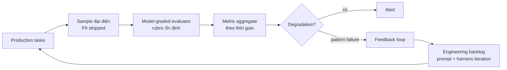

# Evaluation Pipeline

**Evaluation pipeline là production infrastructure, không phải bước QA.** Hầu hết team coi agent evaluation như thứ xảy ra trước deploy: chạy eval suite, check score chấp nhận được, ship. Model này **hỏng trong vài tuần** sau khi live, vì dữ liệu production bộc lộ failure mode mà eval set trước deploy không cover.

## Continuous, không phải periodic

Evaluation pipeline cho production agent cần chạy **liên tục**. Mọi agent task hoàn thành — thành công hay không — là một data point để hiểu hành vi hệ thống.

Một subset task hoàn thành tự động route đến **model-graded evaluator** check chất lượng theo rubric. Pattern failure trong evaluator feed back vào prompt và harness iteration.

## Yêu cầu hạ tầng

Không phải investment nhỏ. Production evaluation pipeline cần:

- **Sample đại diện** của task production thực (PII đã strip khi cần)
- **Model-graded evaluator** với rubric ổn định, well-defined
- **Metric aggregate theo thời gian** — không chỉ snapshot point-in-time
- **Alert khi metric degradation** — bắt quality regression trước khi compound
- **Feedback loop** từ kết quả evaluation đến backlog engineering

> Team vận hành agent đáng tin cậy ở scale đều có infrastructure này. Team chật vật qua vài tháng đầu production hầu như không có.

## Liên hệ

- Feedback loop dựa trên [[agent-observability|execution trace]] và cost attribution để biết task nào đáng sample.
- Cộng hưởng với bài học "tinh chỉnh không bao giờ kết thúc" của [[production-reliability]]: dự án bảo hiểm đi từ 85% → 95% accuracy qua 2 tháng tuning liên tục — chỉ khả thi khi có continuous evaluation.
- Là ưu tiên cuối trong [[harness-checklist]] (build trong 60 ngày đầu production).

## Xem thêm
- [[harness-engineering]] · [[agent-observability]] · [[harness-checklist]]
- [[production-reliability]] — tinh chỉnh lặp không bao giờ kết thúc
