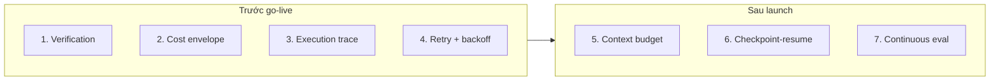

# Harness Checklist (Priority)

Team deploy AI agent production nên tập trung effort engineering vào đâu? Dựa trên failure mode gây nhiều incident production nhất, đây là thứ tự ưu tiên **build gì trước** cho tầng [[harness-engineering|harness]].

| # | Hạng mục | Vì sao | Khi nào build |
|---|---|---|---|
| 1 | Verification có cấu trúc sau mỗi tool call ([[silent-tool-call-failures]]) | Bắt #1 reliability killer ngay | Implement đầu tiên |
| 2 | Cost envelope với hard limit ([[agent-cost-management]]) | Ngăn chi phí runaway thảm họa | Trước khi go live |
| 3 | Step-level execution trace ([[agent-observability]]) | Không có thì debug production bất khả thi | Trước khi go live |
| 4 | Retry policy (exponential backoff + max count) | Resilience cơ bản — table stakes | Table stakes |
| 5 | Context budget tracking ([[context-window-management]]) | Ngăn overflow ở task phức tạp quan trọng | Sprint đầu sau launch |
| 6 | Checkpoint-resume cho task long-horizon ([[context-window-management]]) | Bắt buộc nếu task > 10-15 bước | Khi đã hiểu phân bố độ dài task |
| 7 | Continuous evaluation pipeline ([[evaluation-pipeline]]) | Biết hệ thống tốt lên hay xấu đi theo thời gian | Trong 60 ngày đầu production |

## Đọc checklist thế nào

- **Mục 1-4 là điều kiện go-live**: verification, cost hard limit, execution trace, retry với backoff.
- **Mục 5-7 xây dần sau launch** khi đã có dữ liệu production thực về độ dài task và failure pattern.

Mọi pattern trong checklist đến từ một **incident production thực**. Mục tiêu: học những bài này từ tài liệu, không phải từ cuộc gọi page 3 giờ sáng của chính bạn.

## So sánh với roadmap 47Billion

Checklist này bổ sung cho [[agent-deployment-roadmap]] (47Billion): roadmap đó tổ chức theo **phase áp dụng** (Quick Wins → Hardening → Advanced), còn checklist này ưu tiên theo **failure mode gây incident**. Hai góc nhìn đồng thuận ở điểm cost monitoring/limit phải có sớm.

## Xem thêm
- [[harness-engineering]] · [[silent-tool-call-failures]] · [[agent-cost-management]]
- [[agent-observability]] · [[context-window-management]] · [[evaluation-pipeline]]
- [[agent-deployment-roadmap]] — roadmap theo phase (47Billion)
