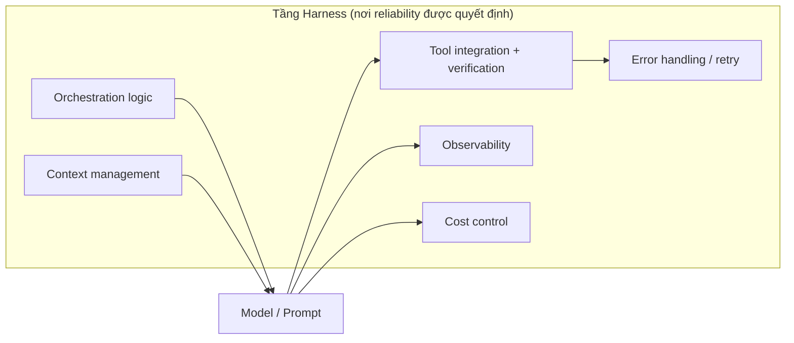

# Harness Engineering

**Harness** là toàn bộ hạ tầng bao quanh model: logic orchestration, code tích hợp tool, quản lý context, error handling, và verification step. Bài học cốt lõi từ production: **hầu hết failure xảy ra ở tầng harness, không phải tầng model.**

Khi agent fail, bản năng là "model làm sai gì?". Câu trả lời trung thực trong hầu hết trường hợp: *không gì cả*. Một retry policy thiếu, một [[silent-tool-call-failures|tool call fail im lặng]], một [[context-window-management|context window tràn]] ở bước 15 của task 20 bước — không cái nào là model failure. Đây là **harness failure**.

## Model layer vs harness layer

Model là phần **dễ thấy nhất** nên hút hết attention. Nhưng đó là một component; harness là phần còn lại.

## Prompt optimization có lợi ích giảm dần

$$\text{completion rate} \xrightarrow{\text{prompting}} \sim 85\text{–}90\% \xrightarrow{\text{harness engineering}} 97\%$$

- Tối ưu prompt đưa task phức tạp lên khoảng **85-90%** completion rate rồi chững lại.
- Từ **90% lên 97%** cần engineering: verification loop, structured error handling, fallback path, [[agent-observability|observability]].
- Pattern lặp lại: team quan sát failure rate 15-20%, dành 2 tháng tinh chỉnh prompt xuống 11%, trong khi root cause thật là một [[silent-tool-call-failures|silent tool call failure]] mà một verification step sẽ bắt ngay.

## Misallocated engineering effort

Pattern đằng sau hầu hết production failure là **phân bổ effort sai chỗ**: đầu tư nặng vào model selection và prompt (phần lấp lánh), under-invest vào harness (phần quyết định hệ thống có hoạt động). Kỷ luật trưởng thành đến khi team ngừng tối ưu thứ sai và bắt đầu build harness cho đúng.

Deploy AI agent production là **systems engineering problem**: verification loop, context management, observability, cost control, evaluation pipeline, graceful degradation.

## Xem thêm
- [[silent-tool-call-failures]] · [[context-window-management]] · [[agent-observability]]
- [[agent-cost-management]] · [[evaluation-pipeline]] · [[harness-checklist]]
- [[production-reliability]] — reliability playbook từ góc nhìn 47Billion
