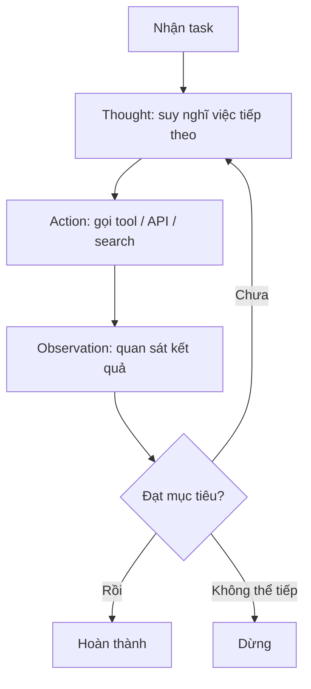

# ReAct Pattern

**ReAct** (Reasoning and Acting — Lý luận và Hành động) là pattern nằm ở trọng tâm của mọi framework agent. Đây là vòng lặp khiến agent trông có vẻ thông minh: agent luân phiên giữa **suy nghĩ** (reasoning) và **hành động** (acting), quan sát kết quả, rồi tiếp tục cho đến khi đạt mục tiêu hoặc quyết định không thể tiếp tục.

## Vòng lặp

## Ví dụ: agent phỏng vấn

- **Thought**: "Người dùng muốn luyện phỏng vấn dev Python. Tôi cần câu hỏi theo vai trò."
- **Action**: Gọi tool tạo câu hỏi với `role=Python Developer, level=Mid`
- **Observation**: Nhận 5 câu hỏi về data structures, OOP, concurrency
- **Thought**: "Câu hỏi tốt. Trình bày câu đầu tiên và chờ phản hồi."
- **Action**: Hiển thị câu hỏi, ghi âm câu trả lời người dùng
- **Observation**: Người dùng nói về list comprehensions nhưng bỏ sót generator expressions
- **Thought**: "Đánh giá theo rubric. Chấm điểm và đưa phản hồi xây dựng."
- **Action**: Gọi tool đánh giá với câu trả lời và rubric
- **Observation**: Score 7/10. Phản hồi đã tạo. Chuyển sang câu tiếp theo.

## Vì sao quan trọng

Vòng lặp reasoning-acting-observation này phân biệt agent với hệ thống prompt-response đơn giản. Mọi framework đã được kiểm thử — [[autogen|AutoGen]], [[crewai|CrewAI]], [[llamaindex|LlamaIndex]], [[openai-agents-sdk|OpenAI Agents SDK]] — đều cài đặt một **biến thể của ReAct**.

Bài học then chốt từ production:

> Chất lượng của agent phụ thuộc nhiều vào việc các thành phần được tích hợp tốt đến đâu, hơn là độ thông minh của LLM bên dưới. **Một model trung bình với tooling xuất sắc sẽ vượt trội hơn một model thông minh với orchestration kém.**

ReAct là cơ chế nền tảng cho [[autonomy-spectrum|Level 3 (Tool-Using Agents)]] trở lên. Ở các level thấp hơn (prompt chaining, workflow có branching), agent chưa tự quyết định gọi tool nào nên chưa cần đến vòng lặp ReAct đầy đủ.

## ReAct như một closed-loop control system (production)

Case study [[stripe-financial-compliance-agents|Stripe]] mô tả ReAct dưới góc nhìn control theory: observation được **inject bắt buộc** trở lại context sau mỗi action, agent không được sang action kế tiếp trước khi xử lý feedback (observation) của action trước. Lợi ích ở production regulated:

- **Grounds reasoning in actual data** — chống bịa kết quả.
- **Prevents reasoning drift** — observation là checkpoint neo reasoning vào output thực tế.
- **Auditability** — tạo trace tường minh `tool invocation → observation → reasoning` để log cho compliance (xem [[agent-observability]]).

## Xem thêm
- [[autonomy-spectrum]] — ReAct xuất hiện từ Level 3
- [[agent-frameworks-comparison]] — cách mỗi framework triển khai ReAct
- [[agent-service-architecture]] — vòng ReAct chạy trong Agent Service microservice riêng
- [[stripe-financial-compliance-agents]] — ReAct như closed-loop control ở scale production
