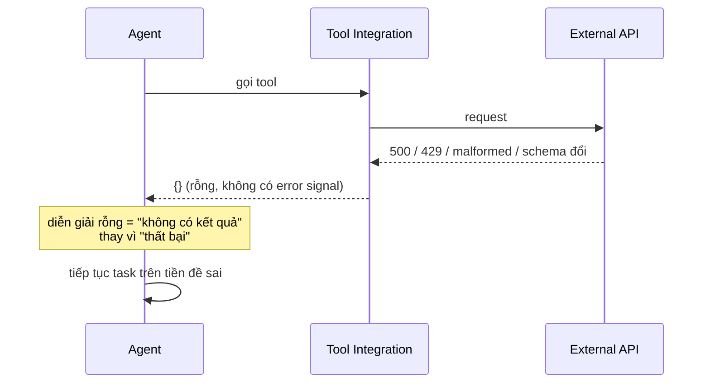

# Silent Tool Call Failures

Trong mọi failure mode gặp khi deploy AI agent production, **silent tool call failure** là phổ biến nhất và đắt nhất — đắt cả về tác động lên completion rate lẫn thời gian debug, vì nó **không để lại signal rõ ràng** trong execution trace.

## Pattern



Code tích hợp tool catch exception nhưng trả về kết quả **rỗng** thay vì signal failure tường minh. Agent diễn giải rỗng là "không có kết quả" chứ không phải "thất bại", và phần còn lại của task chạy trên tiền đề sai.

## Fix: verification loop sau mỗi tool call

```python
# Verify tool call output before passing it forward to the next agent step.
# Without this, API failures propagate silently through multi-step chains.
def verify_tool_output(
    result: ToolResult,
    expected_schema: dict,
    required_fields: list[str]
) -> VerificationResult:
    if result.status_code not in (200, 201):
        return VerificationResult(
            passed=False,
            reason=f"HTTP {result.status_code}: {result.error_message}",
            should_retry=result.status_code in (429, 500, 502, 503)
        )
    if not result.data:
        return VerificationResult(
            passed=False,
            reason="Empty response body",
            should_retry=True
        )
    missing = [f for f in required_fields if f not in result.data]
    if missing:
        return VerificationResult(
            passed=False,
            reason=f"Missing required fields: {missing}",
            should_retry=False  # Schema mismatch won't resolve on retry
        )
    return VerificationResult(passed=True, data=result.data)
```

Pattern: **verify → phân loại failure type → quyết định retry hay escalate**. Thêm 30-50ms mỗi tool call ở một deployment và đưa completion rate từ **81% lên 94%** — model không đổi, prompt không đổi. Verification loop bộc lộ failure trước đó vô hình và cho orchestration layer đủ thông tin để phản ứng đúng.

## Retryable vs non-retryable

Phân biệt là **then chốt**:

| Loại | Ví dụ | Hành động |
|---|---|---|
| Retryable | rate limit (429), transient 500/502/503, empty body | retry (kèm exponential backoff) |
| Non-retryable | schema mismatch, missing fields, authorization error | escalate ngay, không retry |

Retry chung chung mọi tool failure sẽ **đốt token budget** retry các error không bao giờ giải quyết được (liên quan trực tiếp đến [[agent-cost-management|cost runaway]]).

## Xem thêm
- [[harness-engineering]] — tại sao đây là harness failure, không phải model failure
- [[agent-observability]] — execution trace bộc lộ silent failure
- [[harness-checklist]] — verification là ưu tiên #1
- [[production-reliability]] — "ranh giới rõ ràng tàn nhẫn" cho tool use
